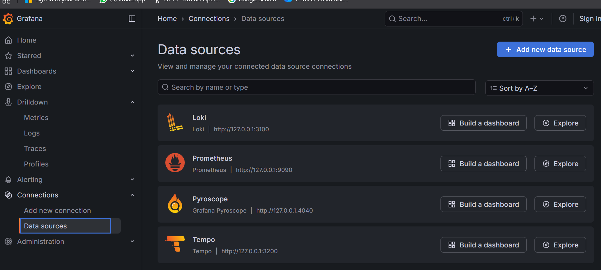

# Enterprise Monitoring & Observability Stack

> Built on top of [Project 1 — Proxmox + pfSense VLAN Network Segmentation](../project-1)

A fully self-hosted, production-grade monitoring and observability platform running on a Proxmox homelab. The stack provides real-time visibility into infrastructure health through unified logs, metrics, traces, and continuous profiling — all accessible through a single Grafana web interface.

---

## Table of Contents

- [What Was Built](#what-was-built)
- [Tech Stack](#tech-stack)
- [Architecture](#architecture)
- [The Monitoring LXC](#the-monitoring-lxc)
- [The LGTM Stack](#the-lgtm-stack)
- [Data Sources](#data-sources)
- [Metrics Collection — Grafana Alloy](#metrics-collection--grafana-alloy)
- [Log Collection — Loki](#log-collection--loki)
- [Live Dashboards](#live-dashboards)
- [Challenges Solved](#challenges-solved)
- [What I Learned](#what-i-learned)

---

## What Was Built

A complete observability platform that monitors the entire homelab infrastructure from a single pane of glass:

| Capability | Tool | Status |
|---|---|---|
| **Metrics** | Mimir (Prometheus-compatible) | Live |
| **Logs** | Loki | Live |
| **Traces** | Tempo | Ready |
| **Profiling** | Pyroscope | Ready |
| **Dashboards & Alerts** | Grafana 12.3.3 | Live |
| **Telemetry ingestion** | OpenTelemetry Collector | Live |
| **Agent (metrics + logs)** | Grafana Alloy | Live on lab-node |

---

## Tech Stack

| Technology | Role | Version |
|---|---|---|
| **Proxmox VE** | Hypervisor / LXC host | 8.x |
| **Ubuntu 22.04 LXC** | Monitoring container OS | 22.04 |
| **Docker** | Container runtime | CE latest |
| **grafana/otel-lgtm** | All-in-one LGTM image | 0.19.0 |
| **Grafana** | Dashboards & alerting UI | 12.3.3 |
| **Loki** | Log aggregation | 3.6.6 |
| **Mimir / Prometheus** | Metrics storage & queries | 3.9.1 |
| **Tempo** | Distributed tracing | 2.10.1 |
| **Pyroscope** | Continuous profiling | 1.18.1 |
| **OpenTelemetry Collector** | Telemetry ingestion | 0.146.1 |
| **Grafana Alloy** | Unified metrics & log agent | latest |

---

## Architecture

```
+-------------------------------------------------------------+
|                     Proxmox Homelab                         |
|                                                             |
|   +--------------------------------------------------+     |
|   |          Monitoring LXC (192.168.0.192)           |     |
|   |                                                   |     |
|   |   +-----------------------------------------+    |     |
|   |   |        Docker: grafana/otel-lgtm         |    |     |
|   |   |                                         |    |     |
|   |   |  Grafana  :3000     Loki     :3100      |    |     |
|   |   |  Mimir    :9090     Tempo    :3200      |    |     |
|   |   |  Pyroscope:4040     OTel :4317/4318     |    |     |
|   |   +-----------------------------------------+    |     |
|   +--------------------------------------------------+     |
|                       ^        ^                            |
|           metrics/logs|        |metrics/logs                |
|                       |        |                            |
|   +------------------+|        |+--------------------+      |
|   |  lab-node LXC    |          |  (future nodes)    |      |
|   |  192.168.0.190   |          |  any LXC / VM      |      |
|   |  Alloy agent     |          |  Alloy agent       |      |
|   +------------------+          +--------------------+      |
+-------------------------------------------------------------+
                        |
                  Browser Access
                        |
            +-----------------------+
            |   Windows Laptop      |
            |  http://192.168.0.192 |
            |         :3000         |
            +-----------------------+
```

**Data flow:**
```
Grafana Alloy (on each monitored node)
  |-- Node metrics --> Mimir  :9090 --> Grafana dashboards
  +-- Journal logs --> Loki   :3100 --> Grafana Explore / log panels
```

---

## The Monitoring LXC

A dedicated **privileged Ubuntu 22.04 LXC container** on Proxmox hosts the entire observability stack. Nesting and keyctl kernel features are enabled, which are required for Docker to manage its own container namespaces within the LXC environment.

| Property | Value |
|---|---|
| Hostname | lxc-monitor |
| IP Address | 192.168.0.192 (static) |
| CPU | 2 cores |
| RAM | 4 GB |
| Disk | 32 GB |
| Privileged | Yes |
| Kernel Features | Nesting, keyctl |


---

## The LGTM Stack

The entire observability backend runs as a **single Docker container** using the official `grafana/otel-lgtm` image. This image bundles six production-grade services that start and wire themselves together automatically.

**Confirmed running services from actual container startup:**

```
Grafana        v12.3.3   -- started in 95 seconds
Loki           v3.6.6    -- started in 6 seconds
Prometheus     v3.9.1    -- started in 5 seconds
Tempo          v2.10.1   -- started in 7 seconds
Pyroscope      v1.18.1   -- started in 6 seconds
OTel Collector v0.146.1  -- started in 5 seconds
```

All data is persisted in named Docker volumes, surviving container restarts and image updates.

<!--Screenshot: `docker-ps.png` — `docker ps` output showing otel-lgtm running with all 8 ports mapped -->


Screenshot: `docker-logs-startup.png` — Container startup logs confirming all 6 services running with their startup times

Screenshot: `grafana-health.png` — Health check returning `"database": "ok"` and Grafana version 12.3.3

---

## Data Sources

All four data sources are **automatically provisioned** by the image — fully functional from the moment the container starts with no manual configuration in Grafana.

| Data Source | Backend | Purpose |
|---|---|---|
| Prometheus | Mimir | Metrics storage and PromQL queries |
| Loki | Loki | Log aggregation and LogQL queries |
| Tempo | Tempo | Distributed trace queries |
| Pyroscope | Pyroscope | Continuous profiling flame graphs |

<!--Screenshot: `grafana-datasources.png` — Grafana Connections page showing all 4 data sources listed and connected -->



---

## Metrics Collection — Grafana Alloy

**Grafana Alloy** is the modern unified agent that replaced the older Promtail + Grafana Agent combination. It runs on each monitored node, collects Linux system metrics via a built-in Node Exporter, and ships them to Mimir using Prometheus remote write.

**Metrics collected from each node:**

- CPU usage per core and total
- Memory — used, available, cached, buffered
- Disk I/O — read/write throughput and IOPS
- Network — receive/transmit rates per interface
- System load average (1m, 5m, 15m)
- File descriptors, context switches, running processes

Screenshot: `alloy-status.png` — `systemctl status alloy` showing active (running) on lab-node

Screenshot: `alloy-logs-success.png` — Alloy journal showing successful WAL replay and confirmed connection to Mimir

---

## Log Collection — Loki

Alloy simultaneously tails the **systemd journal** on each monitored node and ships log entries to Loki in real time. Every log line is labelled with the originating hostname, making it easy to search and filter across all infrastructure from one place in Grafana Explore.

**Labels applied to every log entry:**

| Label | Value |
|---|---|
| `host` | Hostname of the source node (e.g. `lab-node`) |
| `job` | `systemd-journal` |

Screenshot: `grafana-explore-loki.png` — Grafana Explore showing live log stream from lab-node with host and job labels visible

Screenshot: `loki-log-stream.png` — Real-time journal log entries flowing in from lab-node in the Grafana UI

---

## Live Dashboards

### Node Exporter Full

Displays comprehensive real-time system metrics for every node running Alloy — imported from the Grafana community dashboard library (ID: 1860).

Screenshot: `dashboard-node-exporter.png` — Node Exporter Full dashboard showing live CPU, RAM, disk, and network panels for lab-node

### Log Exploration with LogQL

Logs from all nodes are queryable in real time through Grafana Explore. Example queries used in this project:


## Challenges Solved

Real problems encountered and resolved during this project by reading logs and understanding how the systems interact — not from a guide:

### Grafana health check returning empty response
The LGTM stack takes approximately 95 seconds to start all 6 internal services. An immediate `curl /api/health` returned nothing because Grafana's HTTP server had not yet started. Diagnosed by tailing `docker compose logs -f` and confirming the "Grafana is up and running" message before retrying.

### Mimir remote write returning HTTP 404
Alloy reported `server returned HTTP status 404 Not Found` on every metric push. The `grafana/otel-lgtm` image exposes the Mimir write endpoint at `/api/v1/write` — not `/api/v1/push` as commonly documented elsewhere. Identified directly from Alloy's error logs and corrected in the agent config.

### Alloy refusing to start — illegal character error
Alloy uses the **River configuration language**, which does not use semicolons as statement terminators. Inline rule syntax caused `illegal character U+003B ';'` parse errors. Fixed by rewriting each rule block with its properties on separate lines.

### LXC changing IP address after reboot
The monitoring LXC was on DHCP and received a different IP after a reboot, breaking Alloy's push endpoint on all monitored nodes. Fixed by assigning a static IP directly in the Proxmox LXC network configuration panel.


## What I Learned

- How a single Docker image (`grafana/otel-lgtm`) runs an entire production observability stack with zero manual service wiring
- The difference between the **push model** (Alloy pushing to Mimir/Loki) and the **pull model** (Prometheus scraping endpoints) and when each applies
- **Grafana Alloy's River config language** — its pipeline-based component model for building telemetry collection flows
- How to diagnose infrastructure problems by reading container logs and agent journals directly
- **LogQL** for querying, filtering, and graphing log streams across multiple labelled sources
- How Docker named volumes preserve observability data across container updates and host reboots
- Real engineering tradeoffs — weighing strict network segmentation against operational simplicity for a monitoring workload

---

> **Project 1:** [Proxmox + pfSense Enterprise VLAN Network Segmentation](../project-1)
> **Project 3:** Coming soon
